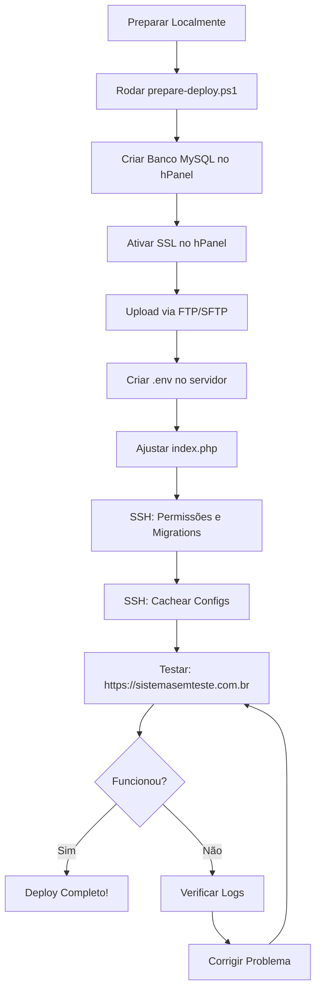

# 📦 Resumo - Deploy para sistemasemteste.com.br

## ✅ Arquivos Criados para o Deploy

### 1. Documentação
- ✅ **DEPLOY_HOSTINGER.md** - Guia genérico completo de deploy na Hostinger
- ✅ **DEPLOY_SISTEMASEMTESTE.md** - Guia específico para seu domínio (sistemasemteste.com.br)
- ✅ **RESUMO_DEPLOY.md** (este arquivo) - Resumo executivo

### 2. Configurações
- ✅ **.env.hostinger** - Arquivo .env pré-configurado para produção
- ✅ **public/.htaccess.hostinger** - .htaccess otimizado com segurança e performance

### 3. Scripts de Automação
- ✅ **prepare-deploy.ps1** - Script PowerShell para preparar arquivos (Windows)
- ✅ **deploy.sh** - Script Bash para deploy automatizado (Linux/SSH)

---

## 🚀 Como Fazer o Deploy (Resumo Rápido)

### Opção 1: Script Automatizado (Recomendado)

**No Windows (PowerShell):**
```powershell
cd c:\Users\caique\Documents\portal\portal
.\prepare-deploy.ps1
```

**O que o script faz:**
1. ✅ Limpa caches
2. ✅ Instala dependências do Composer (produção)
3. ✅ Compila assets (npm run build)
4. ✅ Cria pasta `deploy-hostinger/` com:
   - `portal/` → Todo o Laravel (exceto public)
   - `public_html/` → Conteúdo da pasta public
5. ✅ Cria arquivo LEIA-ME.txt com instruções

**Após rodar o script:**
```
deploy-hostinger/
├── portal/           ← Upload para: /domains/sistemasemteste.com.br/portal/
│   ├── app/
│   ├── bootstrap/
│   ├── config/
│   ├── database/
│   ├── resources/
│   ├── routes/
│   ├── storage/
│   ├── vendor/
│   └── .env.example  ← Renomear para .env e preencher
│
└── public_html/      ← Upload para: /public_html/
    ├── index.php     ← Modificar após upload
    ├── .htaccess
    ├── assets/
    ├── build/
    └── ...
```

### Opção 2: Manual

Se preferir fazer manualmente, siga o guia: **DEPLOY_SISTEMASEMTESTE.md**

---

## 📋 Checklist Pré-Deploy (Fazer ANTES do upload)

- [ ] Rodar `prepare-deploy.ps1` ou preparar arquivos manualmente
- [ ] Compilar assets: `npm run build`
- [ ] Instalar dependências: `composer install --no-dev`
- [ ] Criar conta no hPanel: Databases → MySQL
- [ ] Anotar credenciais do banco de dados
- [ ] Criar email: noreply@sistemasemteste.com.br (opcional)
- [ ] Ativar SSL (Let's Encrypt) no hPanel

---

## 📤 Checklist de Upload (Via FTP/SFTP)

**Credenciais FTP:**
```
Host: ftp.sistemasemteste.com.br (ou ssh.sistemasemteste.com.br)
Port: 22 (SFTP) ou 21 (FTP)
User: u123456789  ← Verificar no hPanel
Pass: [sua senha de acesso]
```

**Upload:**
- [ ] Upload de `deploy-hostinger/portal/` → `/domains/sistemasemteste.com.br/portal/`
- [ ] Upload de `deploy-hostinger/public_html/` → `/public_html/`
- [ ] Verificar se todos os arquivos foram copiados

---

## 🔧 Checklist Pós-Upload (Fazer DEPOIS do upload)

### Via File Manager (hPanel)

1. **Criar .env**
   - [ ] Navegar: `/domains/sistemasemteste.com.br/portal/`
   - [ ] Copiar `.env.example` → `.env`
   - [ ] Editar `.env` e preencher:
     ```env
     DB_DATABASE=u123456789_portal  ← Do hPanel
     DB_USERNAME=u123456789_user     ← Do hPanel
     DB_PASSWORD=senha_forte         ← Do hPanel
     ```
   - [ ] Salvar

2. **Ajustar index.php**
   - [ ] Abrir: `/public_html/index.php`
   - [ ] Substituir:
     ```php
     // ANTES
     require __DIR__.'/../vendor/autoload.php';

     // DEPOIS
     require __DIR__.'/../domains/sistemasemteste.com.br/portal/vendor/autoload.php';
     ```
   - [ ] Fazer o mesmo para `bootstrap/app.php` e `storage/framework/maintenance.php`
   - [ ] Salvar

3. **Ajustar .htaccess (Ativar HTTPS)**
   - [ ] Abrir: `/public_html/.htaccess`
   - [ ] Descomentar linhas:
     ```apache
     RewriteCond %{HTTPS} off
     RewriteRule ^(.*)$ https://%{HTTP_HOST}%{REQUEST_URI} [L,R=301]
     ```
   - [ ] Salvar

### Via SSH (Obrigatório)

Conectar via SSH:
```bash
ssh u123456789@ssh.sistemasemteste.com.br
```

**Executar comandos:**

```bash
# 1. Navegar para a pasta do projeto
cd ~/domains/sistemasemteste.com.br/portal

# 2. Ajustar permissões
chmod -R 775 storage
chmod -R 775 bootstrap/cache
chmod 600 .env

# 3. Rodar migrations
php artisan migrate --force

# 4. Cachear configurações (otimização)
php artisan config:cache
php artisan route:cache
php artisan view:cache

# 5. Verificar se está tudo OK
php artisan about
```

**Importar dados (estados/cidades) - Opcional:**

Via SSH:
```bash
# Se tiver o SQL localmente, fazer upload via FTP primeiro
mysql -u u123456789_user -p u123456789_portal < ~/estados_cidades_brasil.sql
```

Ou via phpMyAdmin (hPanel → Databases → phpMyAdmin):
- Import → Escolher arquivo SQL → Go

---

## ✅ Checklist de Testes (Fazer DEPOIS de tudo configurado)

### Testes Básicos

- [ ] **Acesso ao site:** https://sistemasemteste.com.br
  - [ ] Página carrega sem erro 500
  - [ ] HTTPS ativo (cadeado verde)
  - [ ] Página de login aparece

- [ ] **Login:**
  - [ ] Fazer login com usuário existente
  - [ ] Verifica se redireciona para dashboard

- [ ] **Ícones e Layout:**
  - [ ] Bootstrap Icons aparecem (não quadrados)
  - [ ] Menu lateral está correto
  - [ ] Tabelas formatadas corretamente

- [ ] **Funcionalidades CRUD:**
  - [ ] Criar usuário
  - [ ] Editar usuário
  - [ ] Listar usuários
  - [ ] Deletar usuário (se aplicável)

- [ ] **Integração ViaCEP:**
  - [ ] Preencher CEP em formulário
  - [ ] Verificar auto-preenchimento de endereço

### Testes de Segurança

**1. Verificar Headers de Segurança:**
```bash
curl -I https://sistemasemteste.com.br
```

**Deve retornar:**
```
X-XSS-Protection: 1; mode=block
X-Frame-Options: SAMEORIGIN
X-Content-Type-Options: nosniff
Strict-Transport-Security: max-age=31536000
Content-Security-Policy: default-src 'self'; ...
Referrer-Policy: strict-origin-when-cross-origin
```

**2. Testar Rate Limiting:**
```bash
# Fazer 6 tentativas de login rápidas
for i in {1..6}; do
  curl -X POST https://sistemasemteste.com.br/login \
    -d "email=test@test.com&password=123"
done
# Resultado esperado: 6ª requisição → HTTP 429 (Too Many Requests)
```

**3. Verificar Logs:**

Via SSH:
```bash
tail -50 ~/domains/sistemasemteste.com.br/portal/storage/logs/laravel.log
```

**Verificar se NÃO há:**
- ❌ Senhas em texto plano
- ❌ Tokens expostos
- ❌ CPFs/CNPJs sem redação ([CPF], [CNPJ])
- ❌ Emails sem redação ([EMAIL])

**4. Verificar Configurações Críticas:**

Via SSH:
```bash
cd ~/domains/sistemasemteste.com.br/portal

# Verificar .env
cat .env | grep -E "APP_DEBUG|APP_ENV|LOG_LEVEL"

# Esperado:
# APP_DEBUG=false
# APP_ENV=production
# LOG_LEVEL=warning
```

---

## 🐛 Problemas Comuns e Soluções Rápidas

### ❌ Erro 500 - Internal Server Error

**Verificar:**
```bash
tail -50 ~/domains/sistemasemteste.com.br/portal/storage/logs/laravel.log
```

**Soluções comuns:**
1. Permissões:
   ```bash
   chmod -R 775 storage bootstrap/cache
   ```

2. Cache corrompido:
   ```bash
   php artisan config:clear
   php artisan cache:clear
   php artisan view:clear
   ```

3. .env incorreto:
   - Verificar credenciais do banco
   - Verificar APP_KEY

### ❌ Página em branco (sem erro)

**Causa:** Caminho incorreto no `index.php`

**Solução:**
- Verificar `/public_html/index.php`
- Certificar que aponta para `../domains/sistemasemteste.com.br/portal/`

### ❌ CSS/JS não carregam (404)

**Causa:** Assets não compilados ou caminho errado

**Solução:**
1. Localmente: `npm run build`
2. Upload de `public/build/` para `public_html/build/`

### ❌ Erro de conexão com banco de dados

**Verificar:**
1. Credenciais no `.env`:
   ```env
   DB_HOST=localhost  ← Não usar 127.0.0.1
   DB_DATABASE=u123456789_portal
   DB_USERNAME=u123456789_user
   DB_PASSWORD=senha_correta
   ```

2. Banco existe no hPanel:
   - hPanel → Databases → MySQL Databases

### ❌ Ícones aparecem como quadrados

**Já está corrigido!**

O arquivo `app/Http/Middleware/SecurityHeaders.php` já tem:
```php
"font-src 'self' https://cdn.jsdelivr.net https://fonts.gstatic.com data:",
```

Se ainda aparecer, verificar:
```bash
curl -I https://sistemasemteste.com.br/assets/fonts/bootstrap-icons.woff2
# Deve retornar 200 OK
```

---

## 📊 Monitoramento em Produção

### Logs

**Via SSH:**
```bash
# Ver últimas 50 linhas
tail -50 ~/domains/sistemasemteste.com.br/portal/storage/logs/laravel.log

# Acompanhar em tempo real
tail -f ~/domains/sistemasemteste.com.br/portal/storage/logs/laravel.log

# Buscar erros
grep -i "error\|exception" ~/domains/sistemasemteste.com.br/portal/storage/logs/laravel.log | tail -20
```

**Via File Manager:**
- hPanel → File Manager
- Navegar: `/domains/sistemasemteste.com.br/portal/storage/logs/`
- Download do `laravel-YYYY-MM-DD.log`

### Backup

**Automático (hPanel):**
- hPanel → Backups → Weekly Backups
- (Disponível em planos Premium+)

**Manual:**
```bash
# Via SSH - Backup do banco
mysqldump -u u123456789_user -p u123456789_portal > ~/backup_$(date +%Y%m%d).sql

# Via phpMyAdmin
# hPanel → Databases → phpMyAdmin → Export
```

---

## 🔒 Segurança Final - Verificação

### Antes de Anunciar o Site ao Público

- [ ] `APP_DEBUG=false`
- [ ] `APP_ENV=production`
- [ ] HTTPS ativo e forçado
- [ ] `SESSION_SECURE_COOKIE=true`
- [ ] Senha do banco forte (16+ caracteres)
- [ ] .env com permissões 600
- [ ] storage com permissões 775
- [ ] Logs não expõem dados sensíveis
- [ ] Rate limiting testado
- [ ] Headers de segurança ativos
- [ ] Backup configurado

---

## 📞 Suporte e Documentação

### Documentação deste Projeto

1. **DEPLOY_SISTEMASEMTESTE.md** - Guia completo passo a passo
2. **DEPLOY_HOSTINGER.md** - Guia genérico da Hostinger
3. **SECURITY.md** - Política de segurança completa
4. **CODE_REVIEW_CHECKLIST.md** - Checklist de code review
5. **SECURITY_QUICK_START.md** - Guia rápido de segurança

### Suporte Externo

**Hostinger:**
- Chat 24/7: [hpanel.hostinger.com](https://hpanel.hostinger.com)
- Base de conhecimento: [support.hostinger.com](https://support.hostinger.com)
- Telefone: Verificar no hPanel

**Laravel:**
- Documentação oficial: [laravel.com/docs](https://laravel.com/docs)
- Fórum: [laracasts.com/discuss](https://laracasts.com/discuss)

---

## 🎯 Resumo do Fluxo de Deploy



---

## ✅ Status do Deploy

**Próximos Passos:**
1. [ ] Executar `prepare-deploy.ps1`
2. [ ] Criar banco MySQL no hPanel
3. [ ] Ativar SSL no hPanel
4. [ ] Fazer upload via FTP
5. [ ] Configurar .env
6. [ ] Ajustar index.php
7. [ ] SSH: permissões e migrations
8. [ ] Testar site em produção

**Domínio:** sistemasemteste.com.br
**Data de preparação:** 2025-12-04
**Versão:** 1.0

🚀 **Tudo pronto para o deploy!**
