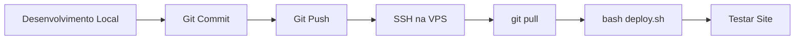

# 📚 Scripts de Deploy e Manutenção - Portal VPS

Este documento contém todos os scripts SQL e Bash criados para o deploy e manutenção do Portal na VPS Hostinger.

---

## 📋 Índice

1. [Scripts SQL](#scripts-sql)
2. [Scripts Bash](#scripts-bash)
3. [Workflow de Deploy](#workflow-de-deploy)
4. [Comandos Úteis](#comandos-úteis)
5. [Troubleshooting](#troubleshooting)

---

## 📊 Scripts SQL

### 1. `migrations_completo.sql`
**Descrição:** Script completo para criar todas as 30 tabelas do sistema.

**Localização:** `/portal/migrations_completo.sql`

**Uso:**
```sql
-- No pgAdmin ou via SSH
psql -U portal_user -d portal_prod -f migrations_completo.sql
```

**O que faz:**
- Cria todas as tabelas do sistema (users, clientes, ordem_servico, etc.)
- É idempotente (pode executar várias vezes sem problema)
- Adiciona índices e foreign keys
- Total: 30 tabelas

---

### 2. `estados_cidades_brasil.sql`
**Descrição:** Popular tabelas de estados e cidades do Brasil.

**Localização:** `/portal/estados_cidades_brasil.sql`

**Uso:**
```sql
-- No pgAdmin
-- Copiar e colar o conteúdo inteiro no Query Tool
```

**O que faz:**
- Cria/verifica tabelas `estados` e `cidades`
- Popula 27 estados brasileiros
- Popula 5.570 cidades
- Cria índices para performance

---

### 3. `fix_user_codigo_sequence.sql`
**Descrição:** Corrige geração automática de código sequencial para usuários.

**Localização:** `/portal/fix_user_codigo_sequence.sql`

**Uso:**
```sql
-- No pgAdmin
-- Executar quando usuários novos não receberem código automático
```

**O que faz:**
- Cria/atualiza sequência na tabela `sequences`
- Preenche códigos vazios em usuários existentes (0001, 0002, etc)
- Cria função `generate_user_codigo()`
- Cria trigger `trigger_generate_user_codigo` para gerar código automaticamente em novos usuários

**Importante:** Execute este script APÓS popular a tabela users pela primeira vez.

---

### 4. `tabelas_usuarios_completo.sql`
**Descrição:** Script específico para criar/atualizar apenas tabela users com todos os campos.

**Localização:** `/portal/tabelas_usuarios_completo.sql`

**Uso:**
```sql
-- Quando precisar adicionar campos faltantes em users
```

**O que faz:**
- Adiciona todas as colunas necessárias em `users`
- Garante que campos como `codigo`, `papel`, `ativo`, `data_nasc` existam

---

## 🐚 Scripts Bash

### 1. `deploy.sh`
**Descrição:** Script automatizado para deploy de atualizações na VPS.

**Localização:** `/portal/deploy.sh`

**Uso:**
```bash
# No SSH da VPS
cd /var/www/sistemasemteste.com.br
bash deploy.sh
```

**O que faz:**
1. Verificações pré-deploy (ambiente, .env, composer, npm)
2. Opções de deploy:
   - Deploy completo (primeira vez)
   - Deploy rápido (atualizações)
   - Apenas compilar assets
3. Backup automático do banco (em produção)
4. Instalação de dependências (Composer + NPM)
5. Compilação de assets (Vite)
6. Execução de migrations
7. Limpeza e cache de configurações
8. Ajuste de permissões
9. Verificações finais (APP_DEBUG, APP_ENV)

**Recursos:**
- ✅ Interativo (pergunta antes de executar ações perigosas)
- ✅ Backup automático
- ✅ Validações de segurança
- ✅ Logs coloridos
- ✅ Rollback em caso de erro

---

## 🚀 Workflow de Deploy

### Fluxo Completo: Local → GitHub → VPS



### Passo a Passo Detalhado

#### 1️⃣ **No seu PC (Desenvolvimento Local)**

```bash
# 1. Desenvolver nova feature
# 2. Testar localmente (php artisan serve)
# 3. Quando estiver funcionando:

git add .
git commit -m "feat: descrição da funcionalidade"
git push origin main
```

#### 2️⃣ **Na VPS (Deploy)**

**Opção A - Deploy Automatizado (Recomendado):**
```bash
ssh root@72.60.60.71
cd /var/www/sistemasemteste.com.br
bash deploy.sh
```

**Opção B - Deploy Manual:**
```bash
ssh root@72.60.60.71
cd /var/www/sistemasemteste.com.br

# Puxar atualizações
git pull origin main

# Instalar dependências
composer install --no-dev --optimize-autoloader
npm install
npm run build

# Rodar migrations (se houver)
php artisan migrate --force

# Limpar caches
php artisan config:clear
php artisan cache:clear
php artisan view:clear
php artisan route:clear

# Otimizar (produção)
php artisan optimize

# Reiniciar Apache (se necessário)
systemctl restart apache2
```

#### 3️⃣ **Testar**

Acessar: https://sistemasemteste.com.br

---

## 🛠️ Comandos Úteis

### Git

```bash
# Ver status
git status

# Ver último commit
git log -1

# Desfazer mudanças locais (cuidado!)
git reset --hard origin/main

# Ver diferenças
git diff
```

### Laravel

```bash
# Limpar todos os caches
php artisan optimize:clear

# Ver rotas
php artisan route:list

# Rodar migrations
php artisan migrate

# Reverter última migration
php artisan migrate:rollback

# Criar nova migration
php artisan make:migration nome_da_migration

# Ver jobs em fila
php artisan queue:work

# Modo manutenção
php artisan down
php artisan up
```

### PostgreSQL

```bash
# Conectar ao banco
sudo -u postgres psql -d portal_prod

# Backup manual
pg_dump -U portal_user -d portal_prod > backup_$(date +%Y%m%d).sql

# Restaurar backup
psql -U portal_user -d portal_prod < backup.sql

# Ver tabelas
\dt

# Descrever tabela
\d users

# Sair
\q
```

### Apache

```bash
# Reiniciar
systemctl restart apache2

# Ver status
systemctl status apache2

# Ver logs de erro
tail -50 /var/log/apache2/error.log

# Testar configuração
apache2ctl -t

# Ver sites habilitados
ls -la /etc/apache2/sites-enabled/
```

### Sistema

```bash
# Ver uso de disco
df -h

# Ver uso de memória
free -h

# Ver processos
top
htop

# Ver portas abertas
ss -tuln

# Verificar firewall
ufw status
```

---

## 🔧 Troubleshooting

### Problema: Erro 500 após deploy

**Solução:**
```bash
# Ver log do Laravel
tail -50 /var/www/sistemasemteste.com.br/storage/logs/laravel.log

# Ver log do Apache
tail -50 /var/log/apache2/error.log

# Verificar permissões
ls -la /var/www/sistemasemteste.com.br/storage

# Corrigir permissões
chown -R www-data:www-data /var/www/sistemasemteste.com.br/storage
chmod -R 775 /var/www/sistemasemteste.com.br/storage
```

---

### Problema: Migrations não rodam

**Solução:**
```bash
# Ver status das migrations
php artisan migrate:status

# Forçar execução (produção)
php artisan migrate --force

# Se der erro de conexão, verificar .env
cat .env | grep DB_
```

---

### Problema: Assets não carregam (CSS/JS)

**Solução:**
```bash
# Recompilar assets
npm run build

# Limpar cache do navegador (Ctrl+Shift+R)

# Verificar se arquivos foram gerados
ls -la /var/www/sistemasemteste.com.br/public/build/
```

---

### Problema: Código de usuário não gera automaticamente

**Solução:**
```sql
-- Executar no pgAdmin
-- Copiar conteúdo de fix_user_codigo_sequence.sql
```

---

### Problema: Site mostra "Work in progress"

**Solução:**
```bash
# Verificar DocumentRoot
cat /etc/apache2/sites-available/sistemasemteste.com.br.conf

# Deve apontar para:
# DocumentRoot /var/www/sistemasemteste.com.br/public

# Remover index.html se existir
rm -f /var/www/sistemasemteste.com.br/public/index.html

# Reiniciar Apache
systemctl restart apache2
```

---

### Problema: SSL não funciona

**Solução:**
```bash
# Verificar DNS
nslookup sistemasemteste.com.br

# Criar pasta para validação
mkdir -p /var/www/sistemasemteste.com.br/public/.well-known/acme-challenge
chown -R www-data:www-data /var/www/sistemasemteste.com.br/public/.well-known
chmod -R 755 /var/www/sistemasemteste.com.br/public/.well-known

# Tentar novamente
certbot --apache -d sistemasemteste.com.br --non-interactive --agree-tos -m caique.soares.silva@gmail.com --redirect
```

---

## 📝 Checklist de Deploy

Use este checklist toda vez que fizer deploy:

### Pré-Deploy
- [ ] Código testado localmente
- [ ] Commit feito com mensagem descritiva
- [ ] Push para GitHub realizado
- [ ] Backup do banco (se mudanças críticas)

### Deploy
- [ ] SSH conectado à VPS
- [ ] `git pull` executado com sucesso
- [ ] Dependências instaladas
- [ ] Assets compilados
- [ ] Migrations executadas (se necessário)
- [ ] Caches limpos

### Pós-Deploy
- [ ] Site acessível (https://sistemasemteste.com.br)
- [ ] Login funcionando
- [ ] Funcionalidades testadas
- [ ] Sem erros 500
- [ ] Logs verificados

---

## 🔐 Credenciais e Acessos

### VPS
- **IP:** 72.60.60.71
- **Usuário:** root
- **Senha:** isAdor@19942026
- **SSH:** `ssh root@72.60.60.71`

### PostgreSQL
- **Host:** 127.0.0.1 (localhost na VPS)
- **Porta:** 5432
- **Database:** portal_prod
- **Username:** portal_user
- **Password:** Portal2025

### pgAdmin (Acesso Remoto)
- **Host:** 72.60.60.71
- **Porta:** 5432
- **Database:** portal_prod
- **Username:** portal_user
- **Password:** Portal2025

### Domínio
- **URL:** https://sistemasemteste.com.br
- **DNS:** Configurado na Hostinger (A record → 72.60.60.71)

### Email (SMTP)
- **Host:** smtp.gmail.com
- **Porta:** 587
- **Username:** caique.soares.silva@gmail.com
- **Password:** akhz wtpe uyya rujc (App Password)

### GitHub
- **Repo:** https://github.com/Caique94/portal.git
- **Branch:** main

---

## 📂 Estrutura de Diretórios na VPS

```
/var/www/sistemasemteste.com.br/
├── app/                    # Código da aplicação
├── bootstrap/
│   └── cache/             # Cache do Laravel (775)
├── config/                # Configurações
├── database/
│   ├── migrations/        # Migrations
│   └── seeders/          # Seeders
├── public/               # DocumentRoot do Apache
│   ├── build/           # Assets compilados (Vite)
│   └── index.php        # Entry point
├── resources/
│   ├── views/           # Blade templates
│   ├── js/              # JavaScript
│   └── css/             # CSS
├── routes/              # Rotas
├── storage/
│   ├── app/            # Arquivos da aplicação (775)
│   ├── framework/      # Cache, sessions, views (775)
│   └── logs/           # Logs do Laravel (775)
├── vendor/             # Dependências Composer
├── node_modules/       # Dependências NPM
├── .env               # Configurações (600)
├── composer.json
├── package.json
└── deploy.sh          # Script de deploy
```

---

## 🎯 Boas Práticas

### Desenvolvimento
1. **Sempre testar localmente** antes de fazer deploy
2. **Commits descritivos** (feat, fix, chore, docs)
3. **Não commitar** arquivos sensíveis (.env, credenciais)
4. **Usar branches** para features grandes
5. **Code review** antes de merge

### Deploy
1. **Fazer deploy fora do horário de pico**
2. **Backup antes de mudanças críticas**
3. **Testar imediatamente após deploy**
4. **Monitorar logs** por alguns minutos
5. **Ter plano de rollback**

### Segurança
1. **APP_DEBUG=false** em produção
2. **APP_ENV=production** em produção
3. **Senhas fortes** e únicas
4. **Firewall ativo** (ufw)
5. **SSL/HTTPS** sempre ativo
6. **Backups regulares**
7. **Atualizar dependências** regularmente

### Performance
1. **Cache de configurações** em produção (`php artisan optimize`)
2. **Compilar assets** para produção (`npm run build`)
3. **Usar --no-dev** com Composer em produção
4. **Habilitar OPcache** do PHP
5. **Índices no banco** para queries frequentes

---

## 📅 Manutenção Regular

### Diária
- [ ] Verificar logs de erro
- [ ] Monitorar uso de recursos (disco, memória)

### Semanal
- [ ] Backup do banco de dados
- [ ] Verificar atualizações de segurança
- [ ] Revisar logs de acesso

### Mensal
- [ ] Atualizar dependências (composer update, npm update)
- [ ] Limpar logs antigos
- [ ] Revisar performance
- [ ] Testar restore de backup

### Trimestral
- [ ] Atualizar Laravel para última versão
- [ ] Atualizar PHP se necessário
- [ ] Revisar configurações de segurança
- [ ] Otimizar banco de dados

---

## 📞 Suporte

### Hostinger
- **Site:** https://hpanel.hostinger.com
- **Suporte:** 24/7 via chat no hPanel

### Laravel
- **Documentação:** https://laravel.com/docs
- **Comunidade:** https://laracasts.com/discuss

### PostgreSQL
- **Documentação:** https://www.postgresql.org/docs/

---

## 📌 Links Úteis

- **Aplicação:** https://sistemasemteste.com.br
- **GitHub:** https://github.com/Caique94/portal
- **hPanel:** https://hpanel.hostinger.com
- **Let's Encrypt:** https://letsencrypt.org
- **Laravel Docs:** https://laravel.com/docs/11.x

---

**Última atualização:** 04/12/2025
**Versão:** 1.0
**Autor:** Deploy realizado com assistência do Claude Code
